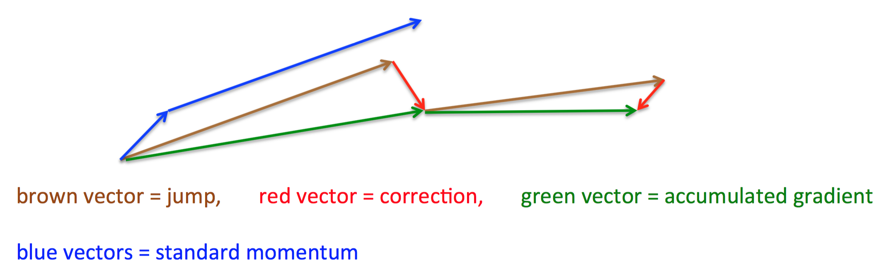

# nesterov

Nesterov momentum是对传统[momentum](../momentum)方法的一项改进，由Ilya Sutskever在Nesterov工作的启发下提出。

基本思路如下图（转自Hinton的coursera公开课lecture 6a）：

首先，按照原来的更新方向更新一步（棕色线），然后在该位置计算梯度值（红色线），然后用这个梯度值修正最终的更新方向（绿色线）。上图中描述了两步的更新示意图，其中蓝色线是标准momentum更新路径。

公式描述为： 

$$\Delta x_{t}=\rho \Delta x_{t-1} - \eta \Delta f(x_{t} + \rho \Delta x_{t-1})$$

