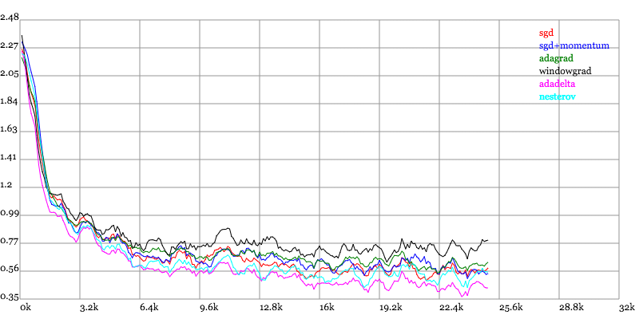
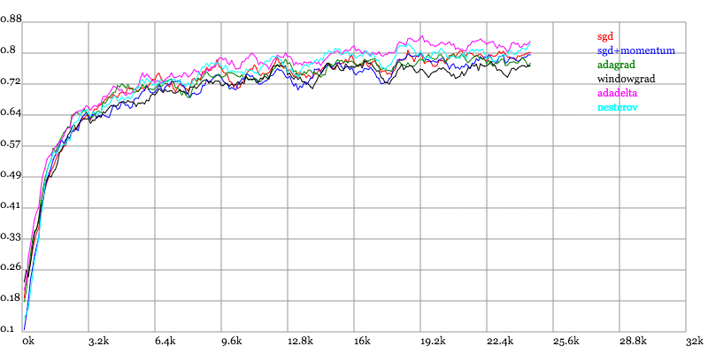
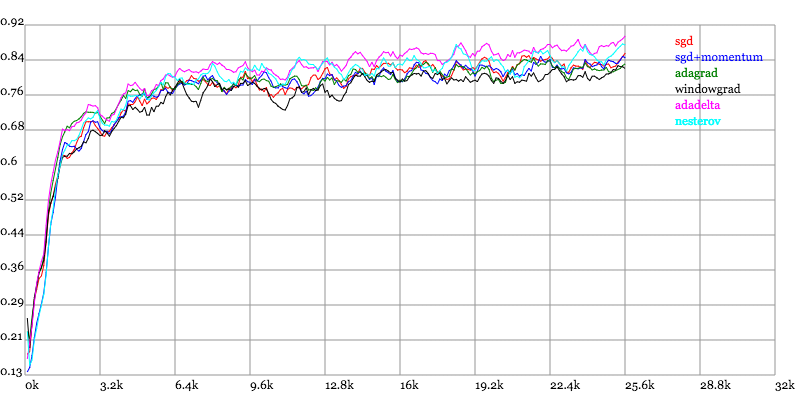

# 优化方法

这里讨论的优化问题指的是，给定目标函数f(x)，需要找到一组参数x，使得f(x)的值最小。

* [SGD](../sgd)
* [Momentum](../momentum)
* [Nesterov](../nesterov)
* [Nesterov](../nesterov)
* [adagrad](../adagrad)
* [adadelta](../adadelta)

[Karpathy](https://karpathy.github.io/)做了一个这几个方法在MNIST上性能的比较，其结论是：

* adagrad相比于sgd和momentum更加稳定，即不需要怎么调参。
* 而精调的sgd和momentum系列方法无论是收敛速度还是precision都比adagrad要好一些。
* 在精调参数下，一般Nesterov优于momentum优于sgd。
* 而adagrad一方面不用怎么调参，另一方面其性能稳定优于其他方法。

Karpathy实验结果图如下：

Loss vs. Number of examples seen

Testing Accuracy vs. Number of examples seen

Training Accuracy vs. Number of examples seen

另一篇介绍梯度下降优化的[文章](http://sebastianruder.com/optimizing-gradient-descent/)。

