# 分词

参考：

* [中文分词算法简介 - 卢嘉颖的博客](http://lujiaying.github.io/2018/01/24/%E4%B8%AD%E6%96%87%E5%88%86%E8%AF%8D%E7%AE%97%E6%B3%95%E7%AE%80%E4%BB%8B/)

中文分词的关键问题包括：切分歧义消解，未登录词识别。常见的未登录词有实体名词、专有名词与新词。未登录词没有明确边界，缺少英语中的分隔符、大小写、词的形态、冠词等语法信息，识别比较困难。因此通常每一类未登录词都要构造专门的识别算法。

## 中文分词的方法

从20世纪80年代或更早的时候起，学者们研究了很多的分词方法，这些方法大致可以分为三大类：

* 基于词表的分词方法
    * 正向最大匹配法(forward maximum matching method, FMM)
    * 逆向最大匹配法(backward maximum matching method, BMM)
    * N-最短路径方法
* 基于统计模型的分词方法
    * 基于N-gram语言模型的分词方法
* 基于序列标注的分词方法
    * 基于HMM的分词方法
    * 基于CRF的分词方法
    * 基于词感知机的分词方法
    * 基于深度学习的端到端的分词方法

## 中文分词的评价指标

在中文分词领域，比较权威且影响深远的评测有 [SIGHAN - 2nd International Chinese Word Segmentation Bakeoff](https://link.zhihu.com/?target=http%3A//sighan.cs.uchicago.edu/bakeoff2005/)。它提供了2份简体中文和2份繁体中文的分词评测语料。

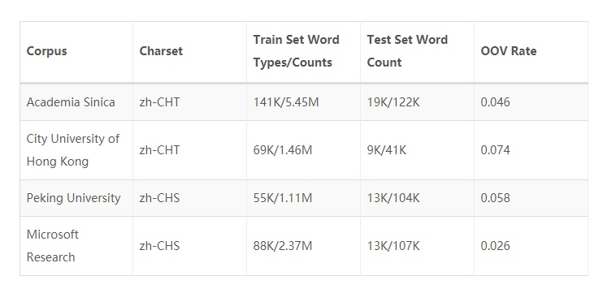

Sighan中采用的评价指标包括：

* 准确率(Precision)

$$Precision = \frac{WordCount(CorrectResults)}{WordCount(TrainSet)}$$

* 召回率(Recall)

$$Recall = \frac{WordCount(CorrectResults)}{WordCount(TestSet)}$$

* F-测度(F-measure)

$$F1 = \frac{2*P*R}{P+R}$$

* 未登录词的召回率(ROOV)
* 词典词的召回率(RIV)

## 分词算法

### 正向最大匹配（FMM）

正向最大匹配法，顾名思义，对于输入的一段文本从左至右、以贪心的方式切分出当前位置上长度最大的词。正向最大匹配法是基于词典的分词方法，其分词原理是：单词的颗粒度越大，所能表示的含义越确切。

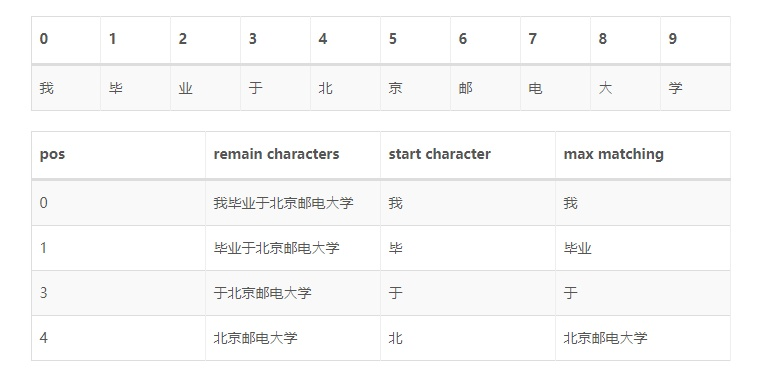

### 反向最大匹配（BMM）

反向最大匹配法的基本原理与正向最大匹配法类似，只是分词顺序变为从右至左。

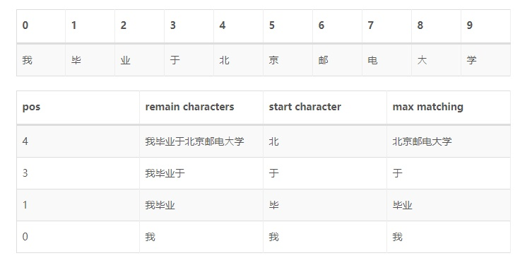

容易看出，FMM或BMM对于一些有歧义的词处理能力一般。举个例子：`结婚的和尚未结婚的`，使用FMM很可能分成`结婚/的/和尚/未/结婚/的`；`为人民办公益`，使用BMM可能会分成`为人/民办/公益`。

虽然在部分文献和软件实现中指出，由于中文的性质，反向最大匹配法优于正向最大匹配法。在成熟的工业界应用上几乎不会直接使用FMM、BMM作为分词模块的实现方法。

### 基于N-gram语言模型的分词方法

由于歧义的存在，一段文本存在多种可能的切分结果（切分路径），FMM、BMM使用机械规则的方法选择最优路径，而N-gram语言模型分词方法则是利用统计信息找出一条概率最大的路径。

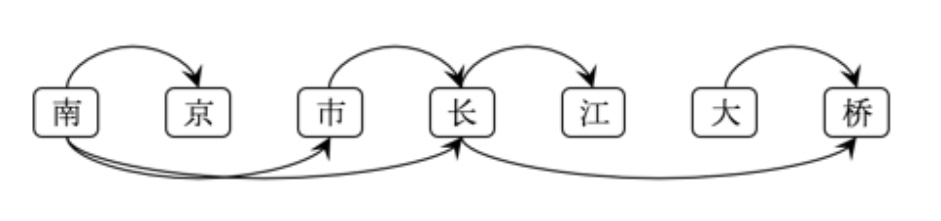

上图为`南京市长江大桥`的全切分有向无环图(DAG)。可以看到，可能的切分路径有：

* 南京/市/长江/大桥
* 南京/市/长江大桥
* 南京市/长江/大桥
* 南京市/长江大桥
* 南京/市长/江/大桥
* 南京/市长/江大桥
* 南京市长/江/大桥
* 南京市长/江大桥
* …

假设随机变量$S$为一个汉字序列，$W$是$S$上所有可能的切分路径。对于分词，实际上就是求解使条件概率$P(W∣S)$最大的切分路径$W^\text{*}$，即

$$W^{*}=\arg\max_W P(W|S)$$

根据贝叶斯公式，

$$W^{*}=\arg\max_W \frac{P(W)P(S|W)}{P(S)}$$

由于$P(S)$为归一化因子，$P(S|W)$恒为1，因此只需要求解$P(W)$。

$P(W)$使用N-gram语言模型建模，定义如下(以Bi-gram为例)：

$$P(W)=P(w_{1}w_{2}\cdots w_{T})= P(w_{1})*P(w_{2}|w_{1})\cdots *P(w_{T}|w_{T-1}) =\prod_{t=1}^{T}\widehat{P}(w_{t}|w_{1}^{t-1})$$

至此，各切分路径的好坏程度(条件概率$P(W|S)$)可以求解。简单的，可以根据DAG枚举全路径，暴力求解最优路径；也可以使用动态规划的方法求解，jieba中不带HMM新词发现的分词，就是DAG + Uni-gram的语言模型 + 后向DP的方式进行的。

### 基于HMM的分词方法

接下来介绍的几种分词方法都属于由字构词的分词方法，由字构词的分词方法思想并不复杂，它是将分词问题转化为字的分类问题（序列标注问题）。从某些层面讲，由字构词的方法并不依赖于事先编制好的词表，但仍然需要分好词的训练语料。

规定每个字有4个词位：

* 词首 B
* 词中 M
* 词尾 E
* 单字成词 S

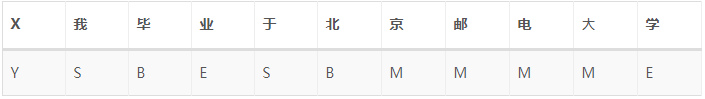

由于HMM是一个生成式模型，$X$为观测序列，$Y$为隐序列。

$$P(X\ ,\ Y)=\prod_{t=1}^{T} P(y_{t}|y_{t-1})*P(x_{t}|y_{t})$$

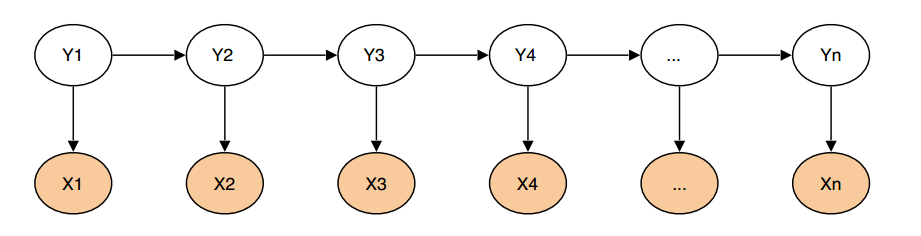

熟悉HMM的同学都知道，[HMM](https://zh.wikipedia.org/zh-hans/%E9%9A%90%E9%A9%AC%E5%B0%94%E5%8F%AF%E5%A4%AB%E6%A8%A1%E5%9E%8B)有三类基本问题：

* 预测(filter)：已知模型参数和某一特定输出序列，求最后时刻各个隐含状态的概率分布，即求$P(x(t)\ |\ y(1),\cdots,y(t))$。通常使用前向算法解决。

* 平滑(smoothing)：已知模型参数和某一特定输出序列，求中间时刻各个隐含状态的概率分布，即求$P(x(k)\ |\ y(1),\cdots,y(t)), k<t$。通常使用forward-backward 算法解决。

* 解码(most likely explanation): 已知模型参数，寻找最可能的能产生某一特定输出序列的隐含状态的序列. 即求$P([x(1)\cdots x(t)]\ |\ [y(1)\cdots ,y(t)])$, 通常使用Viterbi算法解决。

分词就对应着HMM的解码问题，模型参数(转移矩阵，发射矩阵)可以使用统计方法计算得到，原始文本为输出序列，词位是隐状态序列，使用Viterbi算法求解即可。具体方法请参照[link](http://www.52nlp.cn/itenyh%E7%89%88-%E7%94%A8hmm%E5%81%9A%E4%B8%AD%E6%96%87%E5%88%86%E8%AF%8D%E4%B8%80%EF%BC%9A%E6%A8%A1%E5%9E%8B%E5%87%86%E5%A4%87)。

jieba的新词模式就是使用HMM识别未登录词的，具体做法是：针对不在词表中的一段子文本，使用HMM分词，并把HMM的分词结果加入到原始分词结果中。

### 基于CRF的分词方法

与HMM不同，[CRF](https://en.wikipedia.org/wiki/Conditional_random_field)是一种判别式模型，CRF通过定义条件概率$P(Y|X)$来描述模型。基于CRF的分词方法与传统的分类模型求解很相似，即给定feature(字级别的各种信息)输出label(词位)。

$$score(l | s) = \sum_{j = 1}^m \sum_{i = 1}^n \lambda_j f_j(s, i, l_i, l_{i-1})$$

简单来说，分词所使用的是Linear-CRF，它由一组特征函数组成，包括权重$\lambda$和特征函数$f$，特征函数$f$的输入是整个句子$s$、当前pos $i$、前一个词位$l_{i-1}$，当前词位$l_{i}$。

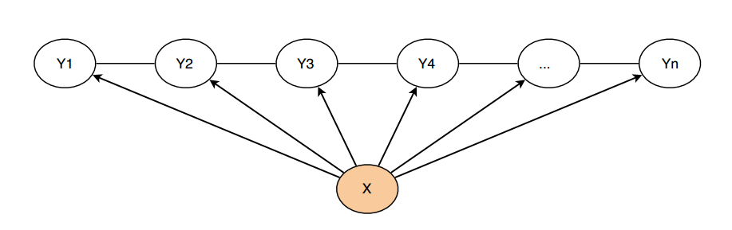

引自[link](http://blog.echen.me/2012/01/03/introduction-to-conditional-random-fields/)，以CRF在词性标注上的应用，给大家一个特征函数的感性认识。

* $f_1(s, i, l_i, l_{i-1}) = 1$，如果$l_i$是副词且第$i$个单词以“−ly”结尾；否则$f_1=0$。该特征函数实际上描述了英语中副词“常常以−ly结尾”的特点，对应的权重$\lambda_1$应该是个较大的正数。

* $f_4(s, i, l_i, l_{i-1}) = 1$，如果$l_{i-1}$是介词且$l_{i}$也是介词，否则$f_4=0$。对应的权重$\lambda_4$是个较大的负数，表明英语语法中介词一般不连续出现。

感性地说，CRF的一组特征函数其实就对应着一组判别规则(特征函数)，并且该判别规则有不同的重要度(权重)。在CRF的实现中，特征函数一般为二值函数，其量纲由权重决定。在开源实现[CRF++](https://taku910.github.io/crfpp/)中，使用者需要规定一系列特征模板，然后CRF++会自动生成特征函数并训练、收敛权重。

与HMM比，CRF存在以下优点：

* CRF可以使用输入文本的全局特征，而HMM只能看到输入文本在当前位置的局部特征
* CRF是判别式模型，直接对序列标注建模；HMM则引入了不必要的先验信息

### 基于深度学习的端到端的分词方法

最近，基于深度神经网络的序列标注算法在词性标注、命名实体识别问题上取得了优秀的进展。词性标注、命名实体识别都属于序列标注问题，这些端到端的方法可以迁移到分词问题上，免去CRF的特征模板配置问题。但与所有深度学习的方法一样，它需要较大的训练语料才能体现优势。

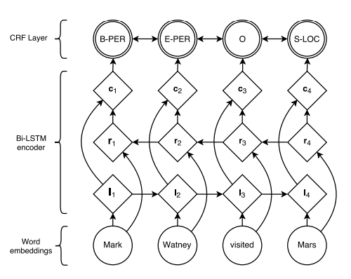

BiLSTM-CRF(参考[link](https://arxiv.org/pdf/1603.01360.pdf))的网络结构如上图所示，输入层是一个embedding层，经过双向LSTM网络编码，输出层是一个CRF层。下图是BiLSTM-CRF各层的物理含义，可以看见经过双向LSTM网络输出的实际上是当前位置对于各词性的得分，CRF层的意义是对词性得分加上前一位置的词性概率转移的约束，其好处是引入一些语法规则的先验信息。

从数学公式的角度上看：

$$S(X, y)=\sum_{i=0}^{n}A_{y_i,y_{i+1}}+\sum_{i=1}^{n}P_{i,y_i}$$

其中，A是词性的转移矩阵，P是BiLSTM网络的判别得分。

$$P(y|X)=\frac{e^{s(X,y)}}{\sum_{\widetilde{y}\in Y_{x}}e^{s(X,y)}}$$

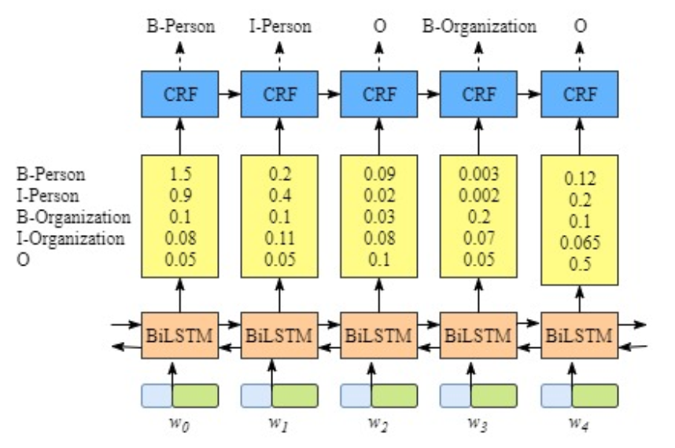

因此，训练过程就是最大化正确词性序列的条件概率$P(y|X)$。

类似的工作还有LSTM-CNNs-CRF([link](https://arxiv.org/abs/1603.01354))。

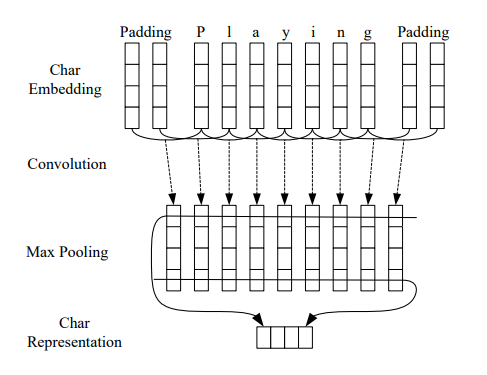

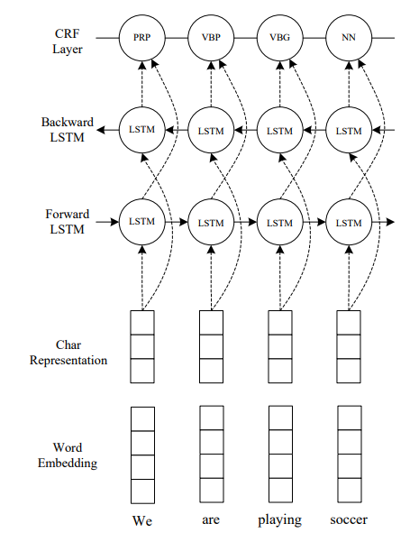