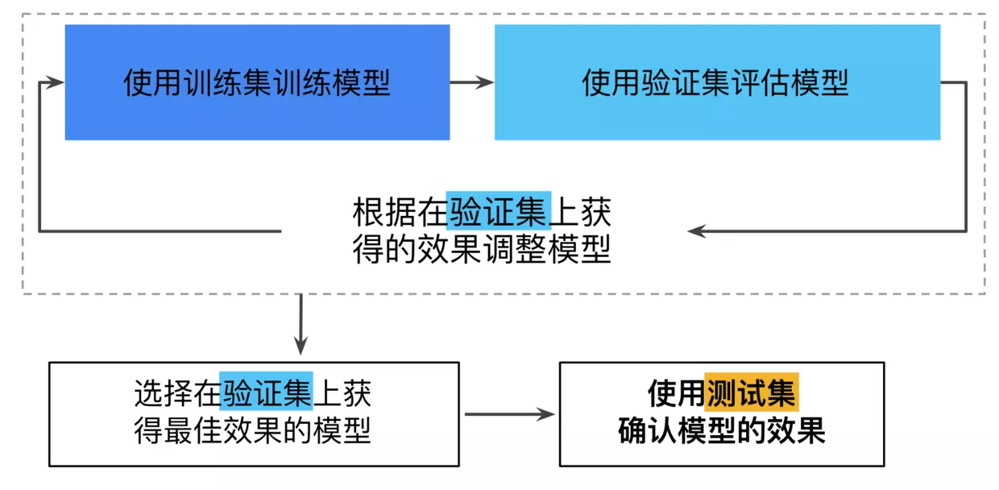

# summary

> https://juejin.im/post/5ab1205cf265da238c3a841c

## 1 机器学习概念

### 1.1 主要术语

#### 标签

预测的事物，即 y = ax + b 中的 y 变量。比如房价、动物种类、是否垃圾邮件等。

#### 特征

输入变量，即 y = ax + b 中的 x 变量，x 可以是一个，也可以是多个，用 {x1, x2, ..., xn} 组成的向量来表示。比如电子邮件的文本字词、邮箱地址、发送时间等。

#### 样本

具体某一个示例，比如一封邮件。

有标签样本：邮件(x) + 是否垃圾邮件(y)

无标签样本：邮件(x)

#### 模型

模型定义了特征与标签之间的关系。

简单的理解为 y = ax + b 中的 a 和 b。

训练：输入 (0, 1), (1, 3), (2, 5)；求出 a = 2, b = 1

预测：输入 x = 10，推断出 y = 10 * 2 + 1 = 13

#### 回归

预测连续值。

#### 分类

预测离散值。

#### 损失

预测值和目标值的差距。

### 1.2 降低损失

梯度下降(Gradient Descent)是一个常用的降低损失的方法。

假如损失函数 `loss = x^2 + 2x + 1` 的梯度函数就是 `loss' = 2x + 2`。

梯度下降方法有 **随机梯度下降 SGD** 和 **小批量梯度下降 mini-batch SGD**。

一般采用 mini-batch SGD 会更加高效。

在 Tensorflow 框架里，梯度下降就是一行代码：

```python
tf.train.GradientDescentOptimizer()
```

#### Learning Rate

学习速率太大容易跳过最小值（or 极小值），太小导致学习时间很长。

> [学习速率 Playground](https://developers.google.com/machine-learning/crash-course/fitter/graph)

### 1.3 过拟合

损失很低，但因为过度拟合了训练集数据，导致在测试集或训练集等新样本上效果很差。

### 1.4 拆分数据

#### 训练集和测试集 (Training and Test Sets)

训练集：用于训练模型的子集。

测试集：用于测试训练后模型的子集。

> [训练集和测试集 Playground](https://developers.google.cn/machine-learning/crash-course/training-and-test-sets/playground-exercise)

### 验证集

一些情况下为了防止不小心在训练过程引入对测试集的拟合，引入验证集（把数据分成了三份）。



### 1.5 特征工程

所有类型的数据，最终都要转换为数字的形式，计算机才能学习。使用的特征要注意：

* 在数据集中出现大约 5 次以上，比如不能用数据的唯一 id 作为特征
* 具有清晰明确的含义
* 不包含超出范围的异常断点或“神奇”的值，比如电影评分为 -1 或 NaN
* 特征的定义不应随时间发生变化，比如`地点：北京`是固定的，但不要用`地点：219`

> [特征组合 Playground](https://developers.google.cn/machine-learning/crash-course/feature-crosses/playground-exercises)

#### 1.5.1 数据类型

**数值数据**

离散数据，连续数据。

**文本数据**

* 作为分类标签

```
{'Netherlands', 'Belgium', 'Luxembourg'} 转换为 {0， 1， 2}
```

* 作为自然语言学习

```
A = “Jinkey 是中国人”
B = “Jinkey 是中国的学生”
A + B 的词列表：（Jinkey, 是, 中国, 人, 的, 学生）
如果具有某个词就用1表示、不具有就用0表示，这样就表示成：
A = （1, 1, 1, 1, 0, 0）
B = （1, 1, 1, 0, 1, 1）
```

**图像数据**

彩色图片是分开 RGBA 四通道的值作为图片特征；灰度图把灰度作为图片特征；黑白图黑色的像素为1白色为0。

#### 1.5.2 数据清洗

**缩放特征值**

有一个特征 A（字段）的值是500000， 有一个特征 B（字段）的值是0.1，这时候需要根据所有样本的 A 特征的最大值和最小值把特征值缩放到[0, 1]之间：

> 缩放值 = (真实值 - 平均值) / 标准差

**处理极端值**

* 对每个值取对数
* 对大于某个值的特征值进行截断，比如 (1, 2, 3, 666, 2, 3) -> (1, 2, 3, 3, 2, 3)

**分箱**

把数值离散化成一个个区间，然后用某个符号来标识。

比如一个处在第6区间的数值可以转换成这两种形式：

* 6
* [0, 0, 0, 0, 0, 1, 0, 0, 0, 0, 0]，这种方式叫 one-hot 编码（具有一个特征为1，其余为0）

**特征组合**

特征组合是指通过将两个或多个输入特征相乘来对特征空间中的非线性规律进行编码的合成特征。

    [A x B]：将两个特征的值相乘形成的特征组合。
    [A x B x C x D x E]：将五个特征的值相乘形成的特征组合。
    [A x A]：对单个特征的值求平方形成的特征组合。

其他

* 遗漏值。例如，有人忘记为某个房屋的年龄输入值。
* 重复样本。例如，服务器错误地将同一条记录上传了两次。
* 不良标签。例如，有人错误地将一棵橡树的图片标记为枫树。
* 不良特征值。例如，有人输入了多余的位数，或者温度计被遗落在太阳底下。

#### 1.5.3 正则化

Q: 为什么要正则化？
A: 惩罚复杂的模型（过拟合的模型）。

机器学习训练目标是损失函数最小化，如果复杂模型也算是一种损失，那么可以把模型复杂度加入到损失函数的公式里面。

Q: 如何衡量一个模型的复杂程度？
A: L<sub>2</sub> 正则，即各变量权重的平方和。

效果：

* 使权重值接近于 0（但并非正好为 0）
* 使权重的平均值接近于 0，且呈正态（钟形曲线或高斯曲线）分布

**Lambda正则系数**

    lambda 值过高 -> 模型会非常简单 -> 欠拟合
    lambda 值过低 -> 模型会非常复杂 -> 过拟合

Q: 为什么有 L<sub>2</sub> 正则 还要 L<sub>1</sub> 正则？
A: L<sub>2</sub> 正则化可以使权重变小，但是并不能使它们正好为 0.0，这样高维度特征矢量会消耗大量的内存。

> [L<sub>2</sub> 正则化 Playground](https://developers.google.cn/machine-learning/crash-course/regularization-for-simplicity/playground-exercise-overcrossing)

> [L<sub>1</sub> 正则化 Playground](https://developers.google.cn/machine-learning/crash-course/regularization-for-sparsity/playground-exercise)

### 1.6 逻辑回归 (Logistic Regression)

### 1.7 神经网络

#### 1.7.1 激活函数

#### 1.7.2 训练神经网络

#### 1.7.3 多类别神经网络

#### 1.7.4 嵌套 (Embedding)

## 2 机器学习工程

### 2.1 生产环境机器学习系统

### 2.2 训练方法

### 2.3 预测方法

### 2.4 数据依赖关系

## 3 机器学习系统在现实世界里的应用

### 3.1 癌症预测

### 3.2 文学

### 3.3 机器学习准则

* 确保第一个模型简单易用
* 着重确保数据管道的正确性
* 使用简单且可观察的指标进行训练和评估
* 拥有并监控你的输入特征
* 将你的模型配置视为代码：进行审核并记录在案
* 记下所有实验的结果，尤其是“失败”的结果
